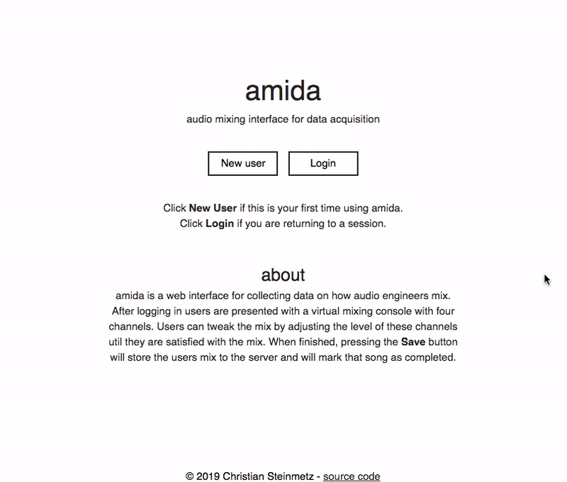

# amida
audio mixing interface for data acquisition

## Demo



## Setup
Clone this repo
```
git clone https://github.com/csteinmetz1/amida
```

Install python and node stuff
```
cd amida
npm install
pip install -r requirements.txt
```

Get complete [DSD100 dataset](https://sigsep.github.io/datasets/dsd100.html) (~14 GB), unzip, and move sources
```
curl http://liutkus.net/DSD100.zip
unzip DSD100.zip
./scripts/move.sh
```

Run audio preprocessing script store samples into `output/`
```
python scripts/process.py DSD100/ output/
```

Create a new Firebase project and then create a `src/keys.js` file that contains firebase admin api info

Launch the webserver in development mode
```
npm run dev
```

## Preprocessing

This process will examine each song in the dataset and find the 30 second section with the greatest RMS energy (where all elements are active). The results of the process will be stored in `output/` and will have the directory structure as shown below. Each song will have a directory within `output/` with separate directories for stereo and mono stems. All stems have been loudness normalized to -28 dB LUFS.
```
.
├── ...
├── output
|   ├── 005 - Angela Thomas Wade - Milk Cow Blues
|   |	├── stereo
|   |   |   ├── bass.wav
|   |   |   ├── drums.wav
|   |   |   ├── other.wav
|   |   |   └── vocals.wav
|   |	└── mono
|   |       ├── bass.wav
|   |       ├── drums.wav
|   |       ├── other.wav
|   |       └── vocals.wav	
|   |
|   └── 049 - Young Griffo - Facade
|   |	├── stereo
|   |   |   ├── bass.wav
|   |   |   ├── drums.wav
|   |   |   ├── other.wav
|   |   |   └── vocals.wav
|   |	└── mono
|   |       ├── bass.wav
|   |       ├── drums.wav
|   |       ├── other.wav
|   |       └── vocals.wav
|   └── ...
└── ...

```
